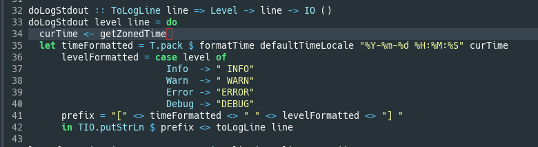

# Howl Intero

This bundle improves the Haskell editing experience in [Howl](https://howl.io/) by providing the IDE-like features of [Intero](https://github.com/chrisdone/intero).

## Complete Features
- [x] Show the type of an expression or identifier.
- [ ] Find uses of an identifier in a module.
- [ ] Find definition of an identifier in a module.
- [ ] List all types of all expressions of all modules loaded.
- [ ] Completion of identifiers within a module's scope.
- [ ] Error checking

Please vote for the feature you'd like to get done next in the Issues section.

## Requirements

- [Stack](https://www.haskellstack.org/)
- Linux (specifically `bash` and the `script` utility from `util-linux`)

## Installation

    $ cd ~/.howl/bundles
    $ git clone https://github.com/dgaw/howl-intero

## Usage

First of all, you should build Intero for the Haskell project you want to use it in.

    $ cd ~/your-project
    $ stack build intero --copy-compiler-tool

Then you can start Howl, open your project and start Intero with `alt_x intero-start`.

When Intero is up and running you can get the type information of the expression at the cursor with `alt_x intero-show-type`.

Of course you can bind these commands to keyboard keys in your `~/.howl/init.moon`, like so:

    howl.bindings.push {
      editor: {
        alt_i: 'intero-start',
        ctrl_t: 'intero-show-type'
      }
    }
